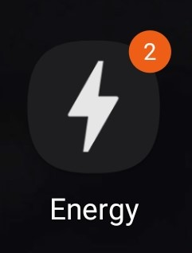
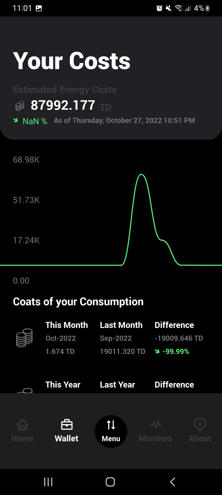
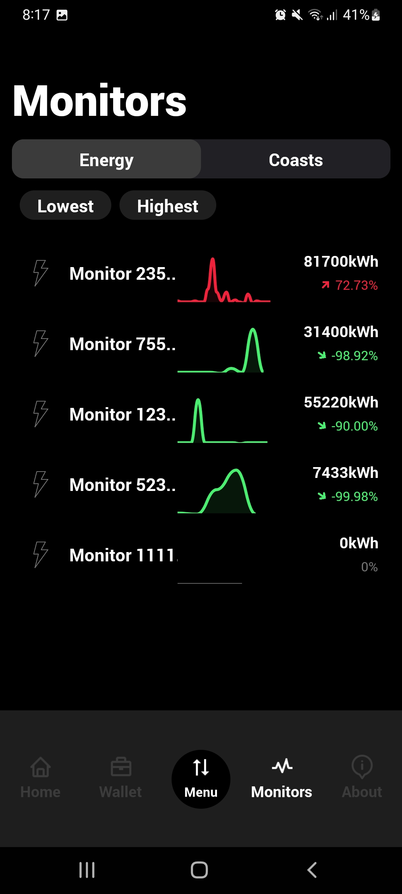
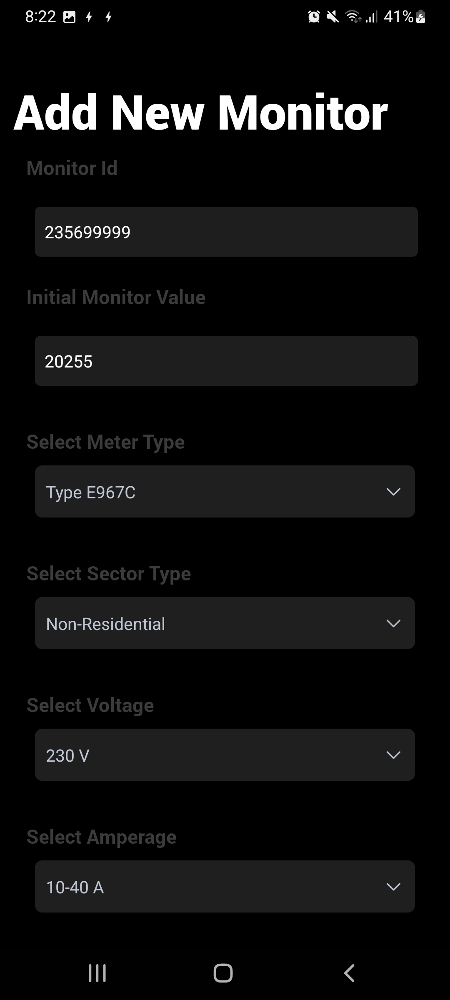
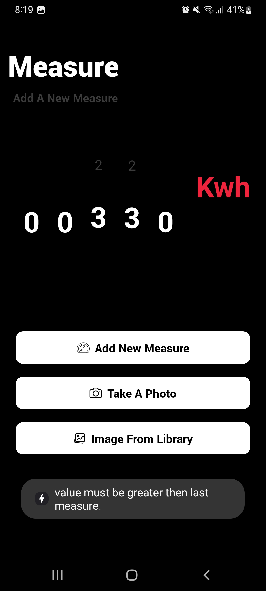
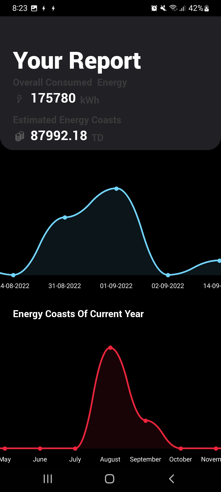
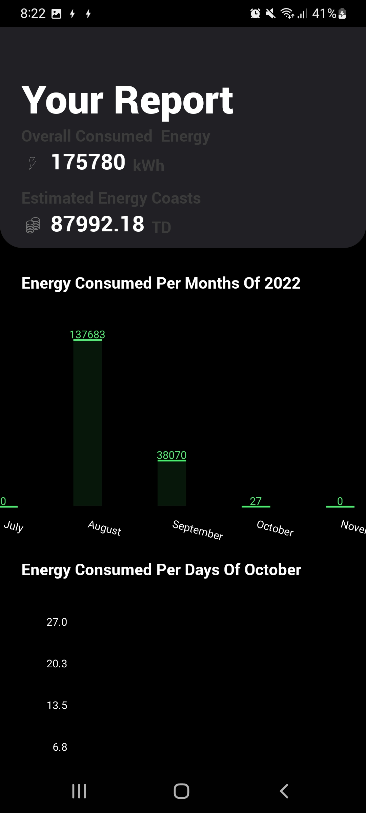
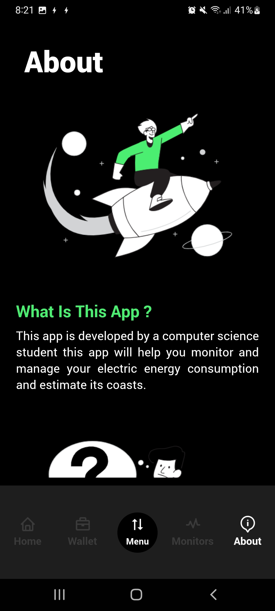

<h1 align="center"> Energy App </h1>  

  

  GitHub in your pocket. Built with React Native.

## Table of Contents

- [Table of Contents](#table-of-contents)
- [Introduction](#introduction)
- [Features](#features)
- [Build Process](#build-process)
- [Used Technologies](#used-technologies)

## Introduction

Track your electric energy consumption and estimate its costs.Built with React Native, Energy App is intended for the residential customer of STEG, Tunisia.

**Available for both iOS and Android.**

  
  

## Features

A few of the things you can do with GitPoint:

- Track your overall consumed energy over time.
- Estimate your energy costs.
- Add new monitors and constantly supervise them.
- Add new energy measures either manually or thanks to the app image processing module.
- Get notified to check on your monitors.
- Get notified daily and if you have exceeded your consumption threshold.
- Multiple types of charts interactive line charts, pie charts, bar charts.
- Better understanding of your energy consumptions and its costs.

  
  
  

  
  
  

## Build Process

- Follow the [React Native Guide](https://facebook.github.io/react-native/docs/getting-started.html) for getting started building a project with native code.
- Clone or download the repo
- `npm install` to install dependencies
- `npx react-native link` to link project assets (fonts etc..)
- `npm run android` to start the packager and run the app in the Android emulator (Android emulator must be already running) or physical device
- To start server side rest API you need to :
- `cd server` to access folder
- `npm install` to install dependencies
- `cd start` to start the server

**Development Notes**:

- Replace process.env.MONGO_DB by your MongoDB uri in server/server.js at `mongoose.connect(process.env.MONGO_DB ...)`
- Replace process.env.PORT by a port number in server/server.js at `app.listen(process.env.PORT ...)`
- This app uses FCM (Firebase cloud messaging to send notifications ) so you need to connect app to firebase console
- you need to add a secretKey.json to the server directory (will be used in /server/routes/sendNotif.js) to generate file please refer to this tutorial [Authorize send requests in Firebase](https://firebase.google.com/docs/cloud-messaging/auth-server#:~:text=To%20generate%20a%20private%20key,confirm%20by%20clicking%20Generate%20Key.)
- Add your IP address to your Api Url in stores/meter/meterActions, stores/measure/measureActions, stores/coast/coastActions to be able to fetch data
- Add your IP address to axios post and get requests url in screens/Measure and screens/Details

## Used Technologies

- Both react and react-redux (to manage app state and fetch data) are used for the app development
- Express.js is used to develop our REST API
- MongoDB is used as our database service
- Firebase FCM is used to send notifications
